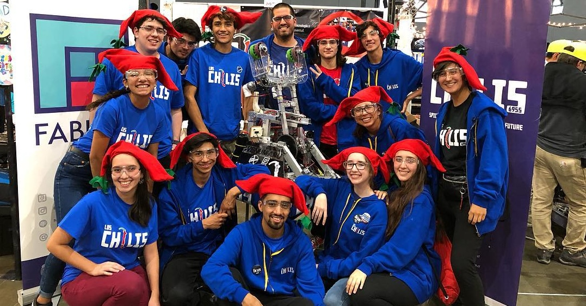

  

Briefly share your passion for robotics and your experience competing on an international stage. Mention how this experience inspired you to make a change in your community.
  
**The Birth of Our Mission:**
  
Detail how and why you decided to found the organization with your friends. Talk about the initial vision and the goals you set out to achieve.
  
**Impact and Reach**:
  
Describe the impact your organization has had on student communities. Highlight the number of students impacted, the creation of robotics teams, and their achievements in international competitions.
Mention the collaboration with major companies and government programs, focusing on how these partnerships helped to extend the reach and impact of your initiatives.
  
**Success Stories:**
  

Include testimonials or brief stories from students or teams who have been part of your programs. This adds a personal touch and shows the real impact on the participants' lives.

  
**The Role of Maker Spaces:**
  

Explain the significance of maker spaces in the educational process and how you facilitated these spaces for creativity and innovation among students.

  
**Reflections and the Road Ahead:**
  

Share your reflections on the journey so far. What have you learned? What has surprised you?
Discuss future plans for your organization and how you plan to continue making a positive impact on the community.

  
**Call to Action:**
  

Conclude with a call to action, inviting readers to get involved, whether through volunteering, donations, or simply by sharing the story to inspire others.